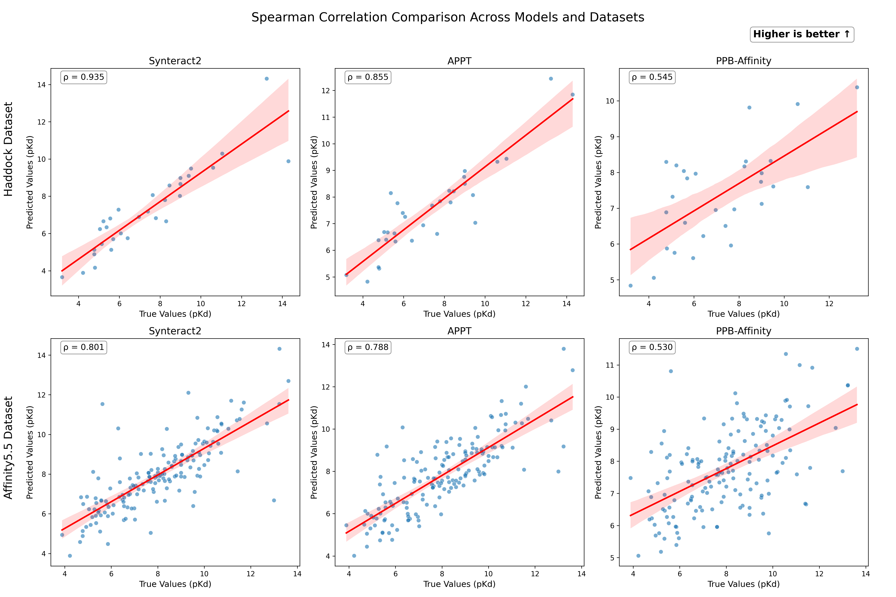
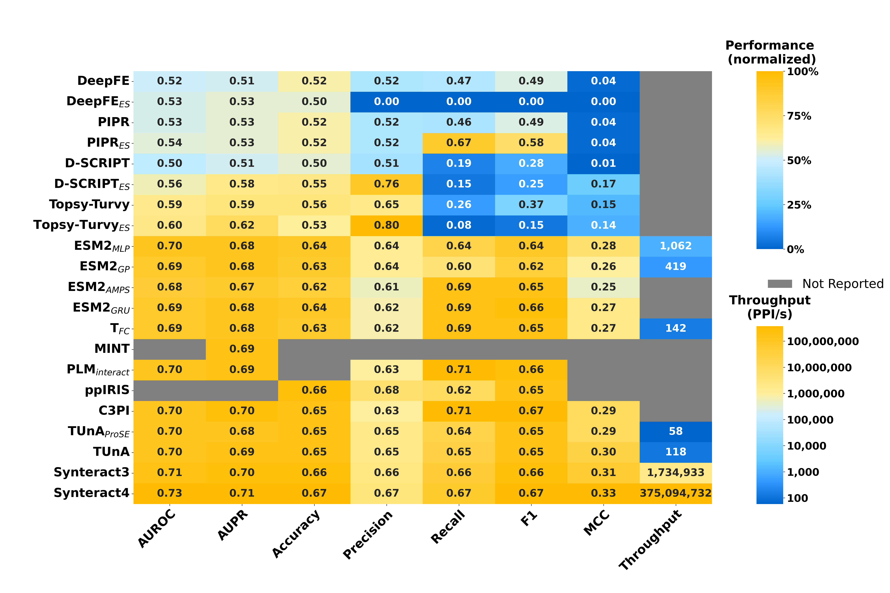
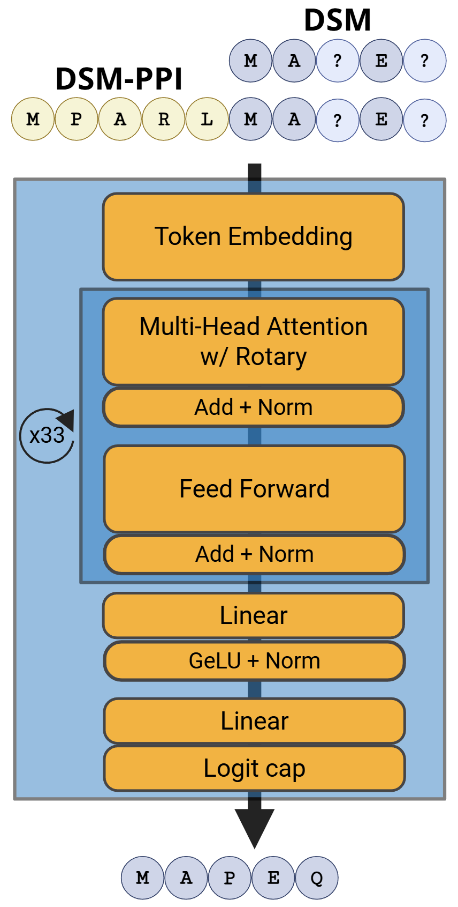
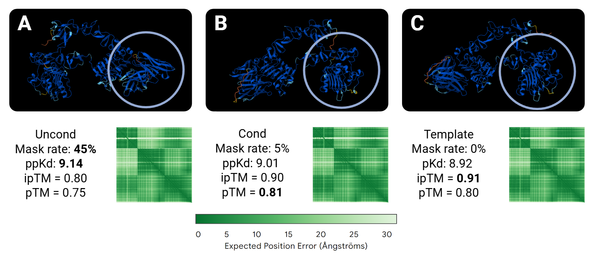
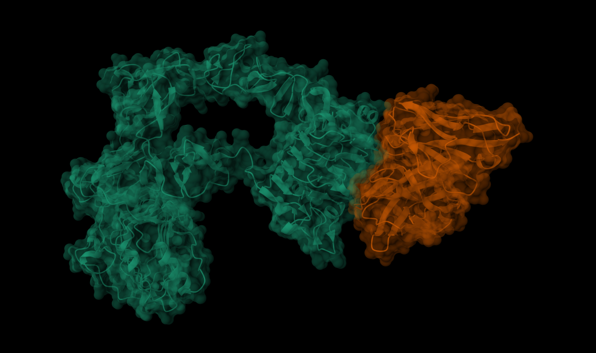
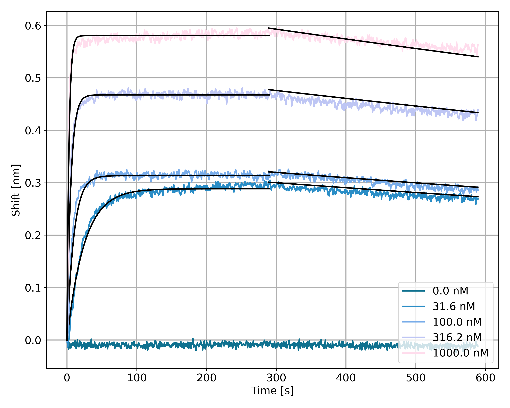
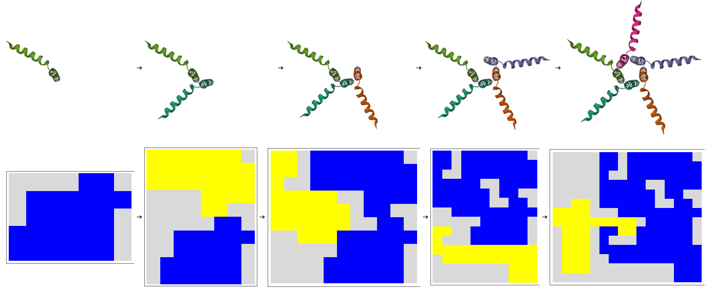
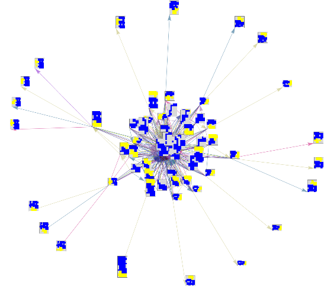
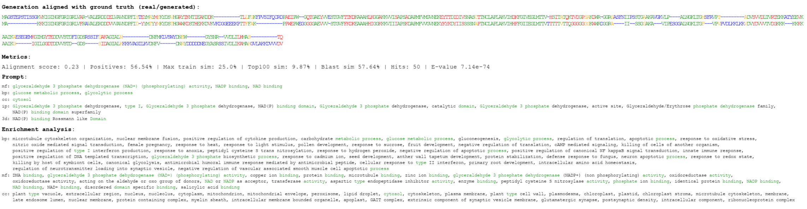

> **“Somewhere in the semantics of natural language and the ambiguity of our understanding in reality leaves truth as one of the great mysteries”**

# Introduction

**Hi, I’m [@lhallee](https://github.com/lhallee)!**  

My name is Logan Hallee. I’m a scientist working on computational protein modeling through the lens of machine learning. I’m the Chief Scientific Officer and Founder of Synthyra, a Public Benefit LLC that operates as a research organization and CRO for protein science. I’m also a PhD Candidate in Bioinformatics at the University of Delaware in the [Gleghorn Lab](https://www.gleghornlab.com/), where my research focuses on protein modeling with transformer neural networks. On the side, I write [Minds and Molecules](https://medium.com/minds-and-molecules), a blog exploring the philosophy behind science and computation.

I’m motivated by safe computational systems that help us better understand the universe at every level of abstraction. However, mostly work towards progress of high-fidelity modeling of the protein universe - efforts that help turn biochemistry into a programmable medium. I believe true biochemical mastery can unlock organic carbon capture, improved crops, efficient circular economies, and major advances in medicine.

### You can find my CV [here](https://docs.google.com/document/d/1q4mQotGm7MyU-TLmf_x17bRxalCy_Fcz/edit?usp=sharing&ouid=110410923518282620159&rtpof=true&sd=true)

# Research Highlights

## Protein-Protein Interaction Prediction (PPI)
### Synteract
- I've worked on a series of models named Synteract, which have made various contributions to the field of PPI.
- Synteract-1 was the first [large language model approach for PPI prediction](https://huggingface.co/GleghornLab/SYNTERACT).
  - Its preprint still ranks in the [**top 3% of research outputs**](https://www.biorxiv.org/content/10.1101/2023.06.07.544109v1.article-metrics) by Altmetric.
  - We showed how negative sampling choices can unintentionally degrade performance (e.g., “accidental localizers”).
- Synteract-2 was a jointly optimized system that predicted PPI, protein–protein binding affinity, and binding site locations, and was Synthyra's first product. At release, it was the top binding affinity predictor on the Affinity v5.5 and Haddock benchmarks.

- I addressed key confounders in PPI data compilation—most recently the [accidental taxonomist](https://www.biorxiv.org/content/10.1101/2025.10.07.681002v1) phenomenon when training from pLM or adjacent embeddings.
  - In review at BMC Bioinformatics
- Synteract-3 was an internal model with a modified workflow relative to Synteract-2, enabling extremely high throughput and full interactome-scale prediction.

- Synteract-4 is Synthyra's current premier product, offering a 10% increase in performance on standardized [gold-standard benchmarks](https://academic.oup.com/bib/article/25/2/bbae076/7621029) compared to the entire field.

### Protein binder design
We leveraged Synteract-2 binding affinity predictions alongside our generative model DSM:
- DSM is the first protein language model (pLM) trained on the LLaDa masked diffusion process, enabling easy extension to pretrained pLMs to turn them into generative models.

<table>
  <tr>
    <td>
      
    </td>
    <td>
      
    </td>
  </tr>
</table>

- DSM preserved representation quality while generating high-quality proteins.
- DSM + Synteract-2 was used to increase the binding affinity of the commercial cancer treatment Cetuximab (projected [**$7B** market cap](https://www.reportsanddata.com/report-detail/cetuximab-market)). At release, our [Cetuximab variants had 90% higher binding affinity to EGFR](https://github.com/Gleghorn-Lab/DSM) versus the commercial option, and 30% higher than the nearest externally designed variant. The data are available on [Proteinbase](https://proteinbase.com/collections/dsm-round-1).

<table>
  <tr>
    <td>
      
    </td>
    <td>
      
    </td>
  </tr>
</table>

### Tetris For Proteins
- Collaborated with **Stephen Wolfram** & other mentors at the Wolfram Winter School.  
- Developed “[Tetris For Proteins](https://community.wolfram.com/groups/-/m/t/2777595)” – a shape-based metric emulating "lock-and-key" protein-protein interactions.  
- Generated hypotheses on protein aggregation likelihood.

<table>
  <tr>
    <td>
      
    </td>
    <td>
      
    </td>
  </tr>
</table>

## Open source projects

### Protify
- Protify is a low code solution for effectively evaluating and fine-tuning chemical language models.
- Easy CLI and GUI interfaces.
- It allows life scientists with no programming expertise to evaluate state-of-the-art models across datasets quickly to identify:
  - The best model for a specific dataset
  - The current limit of the field for a specific problem
- Protify can build production grade models with ease, and we can match the performance of most state-of-the-art protein language model papers with a single CLI command

### SpeedrunningPLMs
- SpeedrunningPLMs is an attempt to apply modern NLP techniques, mostly inspired by the NanoGPT speedrun, toward BERT-like pLM pretraining
- We have reduced the cost of pLM pretraining by over 500×.

### FastPLMs
- FastPLMs is a reimplementation of popular pLMs (ESM2, ESMC, E1) so they can be loaded easily with Hugging Face `AutoModel`. I also added convenience utilities for efficiently embedding entire datasets.
- FastPLMs are downloaded via Hugging Face ~300,000 times per month.

## Additional PhD work

### Annotation Vocabulary
- Invented the [**Annotation Vocabulary**](https://www.biorxiv.org/content/10.1101/2024.07.30.605924v1.abstract), a unique set of integers mapped to popular protein and gene ontologies.  
- Enabled state-of-the-art protein annotation and generation models when paired with its own token embedding.
- We generated **out-of-training-distribution** natural-looking sequences that returned BLAST hits and enrichment results consistent with the prompt.

### Codon Usage Bias
- Codon usage bias is highlighted as a key biological phenomenon and valuable feature for machine learning in [Nature Scientific Reports](https://www.nature.com/articles/s41598-023-28965-7).  
  - Our models show codon usage with a powerful phylogenetic association.
  - Introduced [**cdsBERT**](https://huggingface.co/GleghornLab/cdsBERT), showcasing cost-effective ways to enhance biological relevance in protein language models via a codon vocabulary.
  - Synonymous codon embeddings occupied distinct spaces in latent space, implying that pLMs can improve from codon awareness.

### Mixture of Experts Extension
- Invented a [Mixture of Experts extension](https://arxiv.org/abs/2401.15713) for scalable transformer networks adept at sentence similarity tasks.  
  - Future networks with N experts could perform like N independently trained networks, offering significant time and computational savings in semantic retrieval systems.
  - Published in [Nature Scientific Reports](https://www.nature.com/articles/s41598-025-98185-8)

### Computer Vision in Biology
- Collaborate on lab projects involving deep learning for reconstructing 3D organs from 2D Z-stacks.  
- Informs morphometric and pharmacokinetic studies to further our understanding of organ structure and function.

---

## Additional Projects & Publications

- [featureranker](https://github.com/lhallee/featureranker): A Python package for feature ranking.  
- Textbook Chapter on [Protein Language Models](https://www.researchgate.net/profile/Logan-Hallee/publication/378769504_413_Predicting_Structure_and_Function_of_Biomolecules_Through_Natural_Language_Processing_Tools/links/65e8d39dadc608480a056202/413-Predicting-Structure-and-Function-of-Biomolecules-Through-Natural-Language-Processing-Tools.pdf).
- Machine Learning for identifying [cardioprotective molecules](https://www.ahajournals.org/doi/abs/10.1161/circ.149.suppl_1.P109) in minority groups.
- Investigations of [Hsp90](https://www.mdpi.com/2075-4426/11/12/1373) and [Gamma secretase](https://www.mdpi.com/2075-4426/11/12/1294) in cardiac disease.

---

## Socials / Websites

- [Synthyra](https://synthyra.com/)
- [GitHub](https://github.com/lhallee)
- [LinkedIn](https://www.linkedin.com/in/logan-hallee/)
- [X](https://x.com/Logan_Hallee)
- [Gleghorn Lab](https://www.gleghornlab.com/)
- [Medium](https://medium.com/minds-and-molecules)
- [Substack](https://mindsandmolecules.substack.com/)
- [Facebook](https://www.facebook.com/mindsandmolecules)

### Contact

Research inquiries: lhallee@udel.edu

Business inquiries: logan@synthyra.com

---

> **Last Updated**: January 2026
